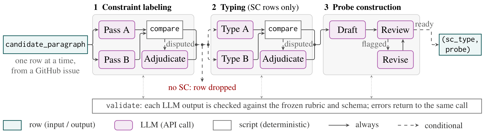

# SC annotation package

The rubric, prompts, schemas and deterministic helper that produced the side
constraints (SCs) of COMPINT-SWE-Natural. Each candidate is one paragraph of a
GitHub issue. Two independent model passes label it, disagreements are
adjudicated, kept SCs are typed into the five SC types, and each SC gets a probe
that is reviewed and revised before export.

[`annotate_sc.py`](../annotate_sc.py) runs the whole pipeline with API model
workers. [`scripts/pipeline.py`](scripts/pipeline.py) does every deterministic
step: freezing, partitioning, validation, comparison, merging and export.

## Pipeline



Stage 1, **Constraint labeling**, applies [SC_RUBRIC.md](SC_RUBRIC.md): whether a candidate paragraph contains a side constraint (SC), and how that decision is recorded. Stage 2 types SC rows using [TYPE_RUBRIC.md](TYPE_RUBRIC.md). Stage 3 writes probes using [PROBE_GENERATION_PROMPT.md](PROBE_GENERATION_PROMPT.md).

| In the figure | Meaning |
| --- | --- |
| `candidate_paragraph`, one row at a time | A row is one paragraph of a GitHub issue; the full issue (`issue_text`) is context. Each row is judged on its own, even when rows from the same issue share a model call. |
| Pass A, Pass B | Two independent model calls apply the rubric to every row. |
| `compare` → disputed → Adjudicate | A script sends a row to adjudication if either pass marks it an SC, the passes differ on any label, gate, span, or field, or either pass is uncertain or flags it for review. It also sends a fixed random sample of 20 rows that both passes rejected. The adjudicator applies the same rubric to the source. Every other row is an agreed non-SC and keeps pass A's record. |
| SC / "no SC: row dropped" | A row is an **SC row** when its final `broad_task_constraint` is `keep`. Rows labeled `drop` or `uncertain` stop here. |
| `validate` | Each model output is checked against `schemas/ANNOTATION_SCHEMA.json` and the rubric's rules (exact spans, gate logic, row labels, indices, review flags). Errors go back to the same call. |
| `sc_type` in the output | One type per SC row, assigned in stage 2. It is separate from the clause-level `sc_types` field in §3 of the rubric. |

## Running it

```bash
bash exp_sh/swe_natural/annotate_open_swe.sh <batch>   # reads studies/swe_natural/generated/sc_candidates.open_swe_<batch>.csv

# or on any candidate sheet
python -m compaction_integrity.dataset.swe_natural_curation.annotate_sc --config-name annotate \
    input_csv=<candidate sheet> run_dir=<new run directory>
```

The input is a candidate sheet with `annotation_id`, `instance_id`,
`candidate_paragraph` and `issue_text`, as written by `dataset.py candidates`.
Settings (worker model, reasoning effort, seed `20260905`, probe revision
rounds) are in `config/tasks/swe_natural/annotate.yaml`. The run freezes this
package into `<run_dir>/frozen/package/`, and every stage reads only that copy.
Rerunning with the same `run_dir` resumes from the last finished partition.
Model labels are stochastic, so a rerun reproduces the prompts and procedure,
not identical labels.

## Stages and the files each worker receives

| Stage | Worker prompt (sent in full) | Helper steps |
| --- | --- | --- |
| Calibration, constructed controls | `SC_RUBRIC.md`, `schemas/ANNOTATION_SCHEMA.json`, `EVALUATION_PROMPT.md` | `review --stage calibration`, `score-controls` |
| Annotation, passes A and B | same as calibration | `validate-annotation`, `review --stage production` |
| Adjudication | the annotation files + `ADJUDICATION_PROMPT.md` | `merge`, `prepare-types` |
| Typing, passes A and B | `TYPE_RUBRIC.md`, `schemas/TYPE_SCHEMA.json`, `TYPE_EVALUATION_PROMPT.md` | `validate-types`, `review-types` |
| Type adjudication | the typing files + `TYPE_ADJUDICATION_PROMPT.md` | `merge-types`, `prepare-probes` |
| Probe drafting | `SC_RUBRIC.md`, `TYPE_RUBRIC.md`, `schemas/PROBE_SCHEMA.json`, `PROBE_GENERATION_PROMPT.md` | `validate-probes`, `collect-probes` |
| Probe review and revision | the drafting files + `PROBE_QUALITY_PROMPT.md` (+ `schemas/PROBE_REVIEW_SCHEMA.json`, or `PROBE_REVISION_PROMPT.md`) | `prepare-revision`, `apply-revision` |
| Export | none | `finalize` |

`ORCHESTRATION_PROMPT.md`, `DISPATCH_TEMPLATES.md`, `CALIBRATION_PROMPT.md`,
`DEDUPLICATION_PROMPT.md` and `VALIDATION_EXPORT_PROMPT.md` describe the same
workflow for an agent coordinator; `annotate_sc.py` follows them in code.

## Outputs

In `export_dir`:

| File | Contents |
| --- | --- |
| `sc_annotations.broad_keeps.typed.csv` | Every kept SC row: exact SC fields, type, and its probe or an explicit hold |
| `sc_annotations.broad_keeps.probe_ready.csv` | Rows whose probe passed review; the input to `dataset.py build --annotations` |
| `sc_annotations.broad_keeps.probes.csv` | One row per probe |

In `run_dir`: `all_candidates.annotated.csv`, `annotations_detailed.jsonl` (all
clauses, gates, evidence, both passes and adjudication), `typed_records.jsonl`,
`probes_final.jsonl`, `review_queue.jsonl`, `final_validation.json`,
`run_report.md`, and `dispatch_log.jsonl` (model and validation for every call).
`SC_RUBRIC.md` §7 defines the exported SC fields.

## Other files

- `references/calibration/`: calibration inputs and the constructed controls with
  their key, read by `prepare` and `score-controls`.
- `references/original_pipeline/`: rubric `0.1-draft` and its prompts, which
  produced the first SWE-Natural batches (`sc_annotations.broad_keeps.typed.csv`
  and `typed_v2.csv`).
- `scripts/audit_package.py` checks the package's files, links and schemas
  against `PACKAGE_MANIFEST.json`; `tests/test_pipeline.py` runs the helper end
  to end on synthetic worker outputs.
